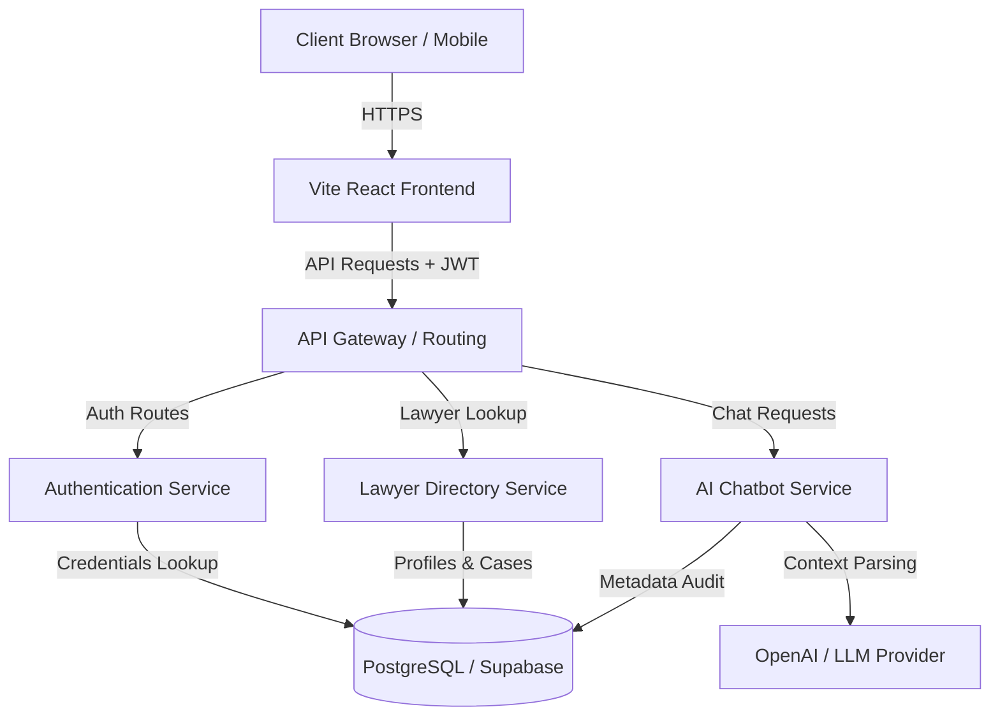

# LexBridge
**Problem Statement:**
Most people who need a lawyer don't know how to find the right one, don't understand what their case is worth pursuing,
and can't tell if the advice they're getting is sound. Legal professionals are discovered through word of mouth or random
internet searches. Case documents are shared over WhatsApp. There's no way to know if an advocate has handled
anything like your situation before. The legal system is technically accessible to everyone and practically accessible to very
few — not because courts are closed, but because the entry point is invisible.
Build something that makes legal help findable, trustworthy, and usable for someone who has never hired a lawyer before.

# Solution: LexBridge

A high-performance, enterprise-grade AI-powered Legal Technology platform designed to democratize access to justice. LexBridge simplifies navigation of the legal system by helping users evaluate claim merits, securely manage legal files, discover vetted legal professionals, and coordinate secure case consultations.

---

## About

The legal system is technically accessible to everyone, but practically accessible to very few. For individuals and small businesses who have never hired a lawyer before, the entry point is invisible. Discovering qualified advocates relies on subjective word-of-mouth recommendations, case documents are routinely shared over insecure chat platforms, and users lack empirical tools to understand if a legal conflict has statutory merit before incurring significant retainer fees.

LexBridge resolves this entry barrier by establishing a secure, transparent, and user-centric workspace. By integrating conversational AI case analysis with audited advocate records, LexBridge translates complex legal processes into clear, linear, and actionable steps. The platform builds user trust through objective verification, strict data isolation, and professional workspace tools.

---

## Key Features

### AI Legal Assistant
An interactive conversational interface (LexBot) that evaluates legal issues using plain language, removing complex legal jargon.

### Lawyer Discovery
A searchable and filterable directory of legal professionals, categorized by specialty areas and geolocations.

### Verified Advocate Profiles
Audited profiles presenting bar registration numbers, experience timelines, court specialties, and verified historical case records.

### AI Document Analysis
Automated parsing tools that summarize dense legal documents, extract key obligations, and list evidence checklists.

### Appointment Booking
A scheduling workflow that connects users with advocates for consultations, featuring automated validation and email confirmation.

### Responsive Workspace
A split-screen layout optimized for desktop, tablet, and mobile drawers, keeping chat consoles and advocate grids in alignment.

### Authentication
Secure identity verification using JWT session controls, token persistence, and secure credential storage.

### Legal Knowledge Assistance
Dynamic guides and answers to frequently asked questions regarding data retention, user rights, and lawyer-client boundaries.

---

## System Architecture



### Frontend
A single-page React application bundled with Vite. It manages visual views, responsive column drawers, client-side route guards, and Zustand store states.

### Backend
A service-oriented architecture (SOA) written in Python and Node.js. It routes requests, processes validation checks, and exposes REST endpoints.

### Database
A relational PostgreSQL database (accessed via Supabase) containing schemas for users, advocate profiles, notable cases, and consultation bookings.

### Authentication
JWT (JSON Web Token) authentication. The client stores tokens in localStorage, automatically appending authorization headers to requests.

### AI Integration
Direct connection with language models to process legal explanations, summarize document uploads, and categorize user conflicts.

### Multi-lingual Chat Support
The chat service can be extended to support multiple languages, allowing users to interact with the AI assistant in their preferred language.

---

## Technology Stack

| Category | Technology |
| :--- | :--- |
| Frontend Core | React 18, Vite |
| Programming Languages | JavaScript (ES6+), Python 3.10 |
| Styling | Tailwind CSS v3, Vanilla CSS |
| State Management | Zustand |
| Router | React Router DOM v6 |
| Backend Services | FastAPI / Express |
| Database | PostgreSQL (Supabase) |
| Authentication | JSON Web Tokens (JWT), bcrypt |
| AI Integration | OpenAI API (GPT-4), LangChain |
| Icons | Lucide React |
| Version Control | Git, GitHub |
| API Layer | REST API, fetch |

---

## Project Structure

```
LexBridge/
├── backend/
│   ├── data/                 # Datasets for training or mock initialization
│   ├── gateway/              # Routing gateway and request proxies
│   ├── scripts/              # Migration and seeding utilities
│   └── services/             # Independent backend logic engines
│       ├── auth/             # Identity and credential verification
│       ├── chat/             # LLM orchestration and keyword mapping
│       └── lawyers/          # Lawyer matching and appointments
├── frontend/
│   ├── dist/                 # Production compiled bundles
│   ├── pages/                # Page route components (Landing, Dashboard, Profile, Privacy)
│   ├── services/             # Fetch-based API client wrappers
│   ├── store/                # Zustand global state definitions
│   └── src/
│       ├── Layout/           # Sticky and glassmorphic headers
│       ├── UI/               # Reusable primitives (Buttons, Cards, Inputs, Modals)
│       ├── chat/             # Monospace chat areas and typing indicators
│       └── lawyers/          # Directory lists and consultation bookings
```

### Folder Directory Details
* `backend/services`: Exposes services for authorization, lawyer directories, and AI prompts.
* `frontend/pages`: Manages top-level routing pages, including the documentation-style Privacy policy.
* `frontend/src/UI`: House reusable visual primitives built to Stripe/Linear specifications.
* `frontend/store`: Manages persistent variables like global themes and auth credentials.

---

## Screenshots

### Landing Page
`[Screenshot Placeholder: Landing Page - Hero Dot Grid and Horizontal Roadmap]`

### Dashboard Workspace
`[Screenshot Placeholder: Dashboard Page - Split Workspace AI Console and Advocate Directory]`

### Lawyer Profile
`[Screenshot Placeholder: Profile Page - Advocate Resume, Verified Badges, and Retainer Cards]`

### Privacy Policy
`[Screenshot Placeholder: Privacy Page - Stripe-style Documentation Layout and Top Progress Bar]`

### Authentication
`[Screenshot Placeholder: Auth Page - Split Forms and Inset Quote Graphics]`

### Document Analysis
`[Screenshot Placeholder: Analysis Modal - Extracted evidence lists and legal term summaries]`

---
## API Overview

### Authentication
* `POST /api/auth/signup` - Register a new user client account.
* `POST /api/auth/login` - Verify credentials and return JWT token.
* `GET /api/auth/me` - Hydrate active user store session.

### Lawyers
* `GET /api/lawyers` - Return all verified advocate list records.
* `GET /api/lawyers/:id` - Return profile information for a specific advocate.

### Chat
* `POST /api/chat/message` - Submit case context to LexBot and receive evaluation reports.

### Documents
* `POST /api/documents/upload` - Securely upload legal agreements or contracts.
* `DELETE /api/documents/:id` - Remove files from data storage buckets.

### Appointments
* `POST /api/appointments/book` - Record date and contact details for consultation booking.

---

## Security

* **JWT Authentication:** Sessions are controlled using signed JSON Web Tokens.
* **Password Hashing:** Passwords are mathematically hashed using bcrypt before database insertion.
* **HTTPS Transport:** All API channels enforce TLS/HTTPS policies.
* **Role-Based Access Control:** Limits administrative profiles and case storage visibility to authorized owners.
* **Input Validation:** Backend endpoints sanitize parameters to block injection attempts.
* **Environment Variables:** Configuration credentials are never hardcoded inside repository code.

---

## Privacy

User privacy is a core operational requirement.

> [!IMPORTANT]
> **Legal Disclaimer**
> LexBridge is a Legal Technology platform and does not operate as a law firm. All assessments, summaries, checklists, and suggestions generated by LexBot are for informational purposes only. They do not constitute legal advice and do not establish an attorney-client relationship. Users should consult a qualified advocate before making final legal decisions.

---

## Future Enhancements
* **Chat History:** Persistent conversation logs for case context continuity.
* **Document Versioning:** Track changes and maintain historical document states.
* **Voice Assistant:** Voice dictation tools for hands-free case input.
* **Court Calendar:** Automated notifications for case hearing dates.
* **Legal Notice Generator:** Templates to automatically draft default notice requests.
* **OCR Improvements:** Advanced OCR tools to extract metadata from scanned handwritten documents.
* **Payment Gateways:** Integrated escrow systems for retainer transactions.

---
---

## License

Distributed under the MIT License. See `LICENSE` for more information.

---

## Team

* **Startup Team Placeholder** - Product development and database architecture.
* **Academic/Engineering Placeholder** - Redesign layouts and AI services.

---

## Acknowledgements

* Inspired by initiatives to improve public access to legal systems.
* Design system tokens inspired by modern enterprise standards from Stripe, Linear, Vercel, and Clerk.
